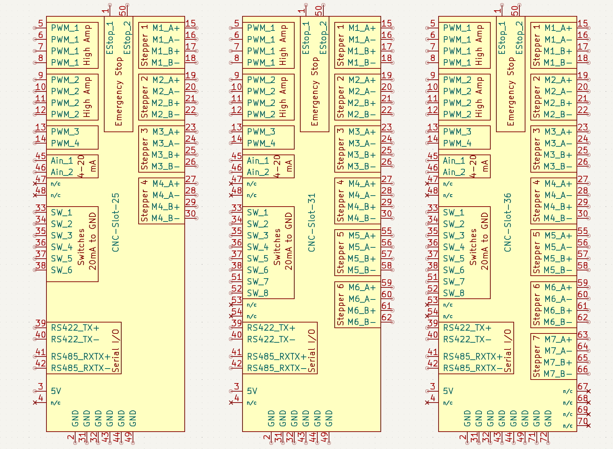

# CNC Standard Slot connector
Goal is to define a standardized connection between typical small CNC machines
or 3D printers that allows to minimize the effort to cable everything.

Status quo is, that there are many boards out there that each provide their own
connectors for motors, endswitches and PWM, and wiring up any machine to a
motor controller board is a mess and requires careful labeling of wires (any
3D printer cabling at the controller board has been a mess that I have seen).
Replacing a board with some other board of another manufacturer requires
wiring in different places, possibly re-crimping cables etc.

This effort defines a card edge connector that should cover the typical
use-cases in these machines. The electrical connection is
  * a 0.1" pitch card edge connector on the controller board side (the "controller cartridge")
  * a PCB with card edge 'fingers' on the machine side. That board is the origin
    of all the wire harness for that particular machine.
Further definition for sizes of the controller cartridge cases, fan options etc.
have to be defined.

The goals are to cover typical use cases in these small machines:
   * Controls bipolar stepper motors up to 3-4A.
   * Provides 2 high power and 2 low power PWM outputs
   * Strongly suggests and requires a couple of safety features.
   * Has a fixed layout, so that a particular pin always is at the same
     place no matter the manufacturer of the controller cartridge.
   * Suggests a couple of serial busses that are more and more needed in
     modern devices.
   * Smallest 25 Pos configuration good for a typical 3D printer.

### Design considerations
(some grab-bag of loosely formulated goals)

  * Interoperability: Provides a standardized output to allow easy exchange of
    controller boards and allow independent competition in the controller
    world, all providing this standard connector. Competition can focus on
    software features, microstepping, motor current capability etc.; the standardized
    connector encourages the users experimenting with different solutions.
  * Goal is to cover the _electrical_ connection to the machine
    (motors, switches, ...), that will allow to have the complicated cable
    harness inside the machine terminate in one place with a specific interface.
  * Non Goals: Explicitly does not define the interfacing
    on the data side - USB, Ethernet, Wireless ? GCode or simple Sub-D25 stepper
    input ? LCD display and user interface or not ?
    This is part of the feature-set provided by the cartridge, but not part
    of the electrical connection to the actuators and switches of the machine.
  * Should cover typical 3D printers, smaller CNC machines or laser cutters.
    * Of course, not every possible configuration can be supported with a
      limited connector with fixed pins but that is explicitly a non-goal. This
      is to define the basic functions that is needed for 98% of all devices.
      It is encouraged to provide additional features via screw terminals or
      the specified robust RS485 bus.
  * Within the same standard connector, there then can be distinguishing
    features of various controllers: provided current for motors, or if the
    two power PWMs can be used together as an H-Bridge.
  * Simplify wire harnesses. They are now fixed part of the printer all
    connecting to the card-edge connector. Easy to pre-fabricate with the
    right cable lengths. Less issues with confusing 'cable salads'.
  * Multiple configurations from minimal 3D printer with up to four steppers
    (with a **25 Pos** card edge connector that is shorter than a 70mm PCB) to
    larger machines with specific requirements: Next level with **31 Pos**
    and **36 pos** level adding more motors.
  * Enforce some safety features and electric recommendations directly in the
    specification that are not yet commonly seen in many controllers today:
     * The high power PWM outputs are only high-side switches to minimize
       dangerous heater-stuck-on failure scenarios.
     * Emergency Stop Switch is part of the specification. Contacts
       strategically placed so that card insertion issues or hot-unplugging
       trigger it.
     * Have all kinds of external switch inputs be current loops and
       normally closed for more resilience.
  * For periphery: suggest busses that are proper in the noisy environment (RS422/485)
    instead of flaky I²C not well suited for an electrically noisy machine.
  * There are two analog inputs, and they define a particular input range in
    voltage.
    That means that adapter amplifiers need to be done on
    the machine side. This allows to adapt various inputs (e.g. Thermistors,
    PT100, ...) without assuming a particular analog interface.
  * (After initial inclusion of power connection, this is now removed as this
    might be handled differently per device)

### Finger levels
The fingers on the card edge come in two lengths

  * All signals including GND: connect first, all the way to the edge.
  * Emergency stop switches connect with recessed fingers so that they
    are triggered first when the connectors are separated.

All output pins can only switch on iff the two e-stop wires on pin 1 and 50
are connected with each other (this will be a current loop of 10mA or so).
The fact that the two pins are recessed and at opposite ends of the connector
will make sure that the outputs are switched off before the connector is being
disconnected completely. This prevents fried motor drivers and accidental shorts.
Even a brief interruption of the e-stop will require a reset from software.

N/C = Not Connected. Typically place holders for Version #1 of this spec.
      Must not be connected to anything to allow future use.

|Pos|Connection    | BTM | TOP |  Connection | Remarks
|---|-------------:|:---:|:---:|:------------|---------------
| 1 |     EStop_1  |  1  |  2  | GND         | Emergency Stop Normally Closed, 10-20mA current loop.
| 2 |       5V-out |  3  |  4  | _N/C_       | -> 5V, max 1A out (for sensors)
| 3 |        PWM_1 |  5  |  6  | PWM_1       | 4 parallel pins: 12A high side switch
| 4 |        PWM_1 |  7  |  8  | PWM_1       | (optional: push pull offering H-Bridge with PWM-2)
| 5 |        PWM_2 |  9  | 10  | PWM_2       | 4 parallel pins: 12A high side switch
| 6 |        PWM_2 | 11  | 12  | PWM_2       | (optional: push pull offering H-Bridge with PWM-1)
| 7 |        PWM_3 | 13  | 14  | PWM_4       | two 3A low side switching PWM (maybe need more?)
| 8 |        M1_A+ | 15  | 16  | M1_A-       | Stepper 1 (Bipolar stepper motor)
| 9 |        M1_B+ | 17  | 18  | M1_B-       |
|10 |        M2_A+ | 19  | 20  | M2_A-       | Stepper 2
|11 |        M2_B+ | 21  | 22  | M2_B-       |
|12 |        M3_A+ | 23  | 24  | M3_A-       | Stepper 3
|13 |        M3_B+ | 25  | 26  | M3_B-       |
|14 |        M4_A+ | 27  | 28  | M4_A-       | Stepper 4
|15 |        M4_B+ | 29  | 30  | M4_B-       |
|16 |          GND | 31  | 32  | GND         |
|17 |         SW_1 | 33  | 34  | SW_2        |  end-stop/prober switches to GND,…
|18 |         SW_3 | 35  | 36  | SW_4        |  …Current Loop 10-20mA
|19 |         SW_5 | 37  | 38  | SW_6        | (prefer Normaly Closed for end-stops)
|20 |    RS422_TX+ | 39  | 40  | RS422_TX-   | RS422-TX. _N/C_ if not supported.
|21 |  RS485_RXTX+ | 41  | 42  | RS485_RXTX- | RS485 Bus and/or RS422-RX; _N/C_ if not supported.
|22 |          GND | 43  | 44  | GND
|23 |        _N/C_ | 45  | 46  | _N/C_       | Not connected in Version #1.
|24 |        Ain_1 | 47  | 48  | Ain_2       | Analog inputs. 4-20mA to GND.
|25 |          GND | 49  | 50  | EStop_2     | **[---- END 25 Pos configuration ----]**
|26 |         SW_7 | 51  | 52  | SW_8        | similar to SW_1 to SW_6
|27 |        _N/C_ | 53  | 54  | _N/C_       | N/C in Version #1 (future: CAN+/CAN- or I²C SDA/SCL ?)
|28 |        M5_A+ | 55  | 56  | M5_A-       | Stepper 5
|29 |        M5_B+ | 57  | 58  | M5_B-       |
|30 |        M6_A+ | 59  | 60  | M6_A-       | Stepper 6
|31 |        M6_B+ | 61  | 62  | M6_B-       | **[---- END 31 Pos configuration ----]**
|32 |        M7_A+ | 63  | 64  | M7_A-       | Stepper 7.
|33 |        M7_B+ | 65  | 66  | M7_B-       |
|34 |       _N/C_  | 67  | 68  | _N/C_       | TODO: what else we want ? 8th motor?
|35 |       _N/C_  | 69  | 70  | _N/C_
|36 |         GND  | 71  | 72  | GND         | **[---- END 36 Pos configuration ----]**

## FAQ
 * **Q:** why are the motors numbered Motor_1, Motor_2, ... and
          not e.g. X, Y, Z ? 
   **A:** Depending on the geometry of the machine, this can have
          different meanings. The mapping of motor number to axis happens
	  in your motion control system configuration.

 * **Q:** Why didn't you include feature _foo_ or _bar_ ?
          It would only use two pins. 
   **A:** There are a myriad of potential features, but the pins are limited.
          The specification intentionally leaves it open to add separate
	  additional connectors to the control board if needed, while the bulk
	  of commonly needed features are covered by this CNC-Slot. 
          It is encouraged to implement purely digital features
          using the high-speed serial busses provided and are already commonly
          used in the industry. 
          Finally, there are couple of pins left unconnected in version 1 for
          which we might find good use in the future. Please propose one in the
          issue tracker to discuss if you think it might be vitally important.

 * **Q:** Why is the analog input reading this weird current range ?
          I can't simply connect a NTC Thermistor to it. 
   **A:** Using thermistors directly in particular over longer cables
          results in noisy measurements as they have a high
	  impedance which results in less robust readings.
	  Luckily, there is a standard way out: in industry settings, analog
	  transducers of all sorts are very commonly translating their
	  measurement range into a [current of 4..20mA][current loop].
	  The low impedance makes this very robust. The CNC-Slot connector
	  encourages this best practice and also makes it compatible with a
	  large number of existing industry standard sensors. 
	  Do adapt the thermistor, you need a little op-amp circuit on the
	  machine side (best: close to the thermistor to minimize noise).

 * **Q:** I see the end-switches are also labelled as current loop. Is that
          complicated as with the thermistor ? 
   **A:** No. You just connect a microswitch between the connector and GND. 
          Current loop in that case means that the controller board will send
	  a current of 10-20mA through the switch to avoid noise.

## Kicad Libraries

### Schematic symbol
There is a schematic symbol library in the [`kicad-library/`](./kicad-library)
directory featuring three symbols to be used for implementing the control
board or machine side in the `cnc-slot.lib` file.

The symbols are all the same size with fixed pin locations so that it is easy
to upgrade without having to re-wire in the schematic.

### Footprints

For the card edge, there is a footprint including necessary `Edge.Cuts`
layer in the [`cnc-slot.pretty`](./cnc-slot.pretty) directory.

This is the footprint to be used on the machine side and typically you'll use
it to create a breakout board to have the machine cabeling harness terminate
in this connector.

The library provides the three variants of card-edge footprints including the
recessed pins for the Emergency stop.

[current loop]: https://en.wikipedia.org/wiki/Current_loop